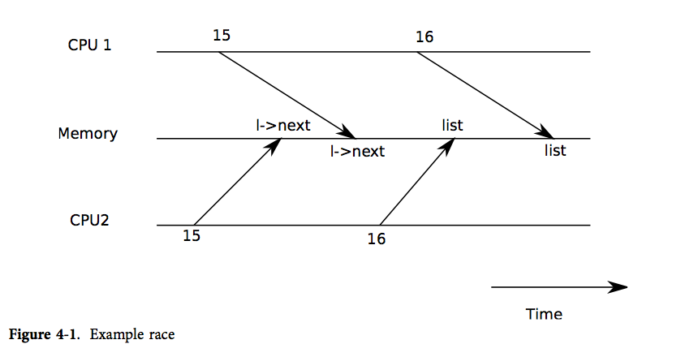

##第4章

###锁

xv6 运行在多处理器上，即计算机上有多个单独执行代码的 CPU。这些 CPU 操作同一片地址空间并分享其中的数据结构；xv6 必须建立一种合作机制防止它们互相干扰。即使是在单个处理器上，xv6 也必须使用某些机制来防止中断处理程序与非中断代码之间互相干扰。xv6 为这两种情况使用了相同的低层概念：*锁*。锁提供了互斥功能，保证某个时间点只有一个 CPU 能持有锁。如果 xv6 只能在持有特定的锁时才能使用数据结构，那么就能保证同一时间只有一个 CPU 能使用这个数据结构。这样，我们就称这个锁保护了数据结构。

本章的其余部分将解释为何 xv6 需要锁，以及 xv6 是如何实现、使用锁的。我们需要重点注意的是在读代码时，你一定要问自己另一个处理器的存在是否会让这行代码无法达到期望的运行结果（因为另一个处理器也可能正在运行该行代码，或者另一行修改这个共享变量的代码），还要考虑如果这里执行一个中断处理程序，又会发生什么情况。与此同时，一定要记住一行 C 代码可能由多条机器指令组成，而另一个处理器或者中断可能在这些指令中间影响之。你不能假设这些代码是顺序执行的，也不能假设一个 C 指令是以原子操作执行的。并发使得考虑代码的正确性变得困难。

####竞争条件

下面举一个例子说明为什么我们需要锁，考虑几个共享磁盘的处理器，例如 xv6 中的 IDE 磁盘。磁盘驱动会维护一个未完成磁盘请求的链表（3821），这样处理器可能会并发地向链表中加入新的请求（3954）。如果没有并发请求，你可以这样实现：

~~~ C
struct list{
    int data;
    struct list *next;
};

struct list *list = 0;

void
insert(int data)
{
    struct list *l;
    l = malloc(sizeof *l);
    l->data = data;
    l->next = list;
    list = l;
}
~~~

证明其正确性是数据结构与算法课中的练习。即使可以证明其正确性，实际上这种实现也是错误的，至少不能在多处理器上运行。如果两个不同的 CPU 同时执行 `insert`，可能会两者都运行到15行，而都未开始运行16行（见图表4-1）。这样的话，就会出现两个链表节点，并且 `next` 都被设置为 `list`。当两者都运行了16行的赋值后，后运行的一个会覆盖前运行的一个；于是先赋值的一个进程中添加的节点就丢失了。这种问题就被称为*竞争条件*。竞争问题在于它们的结果由 CPU 执行时间以及其内存操作的先后决定的，并且这个问题难以重现。例如，在调试 `insert` 时加入输出语句，就足以改变执行时间，使得竞争消失。

通常我们使用锁来避免竞争。锁提供了互斥，所以一时间只有一个 CPU 可以运行 `insert`；这就让上面的情况不可能发生。只需加入几行代码（未标号的）就能修改为正确的带锁代码：

~~~ C
struct list *list = 0;
struct lock listlock;

void
insert(int data)
{
    struct list *l;
       acquire(&listlock);
    l = malloc(sizeof *l);
    l->data = data;
    l->next = list;
    list = l;
       release(&listlock);
}
~~~

当我们说锁保护了数据时，是指锁保护了数据对应的一组不变量（invariant）。不变量是数据结构在操作中维护的一些状态。一般来说，操作的正确行为会取决于不变量是否为真。操作是有可能暂时破坏不变量的，但在结束操作之前必须恢复不变量。例如，在链表中，不变量即 `list` 指向链表中第一个节点，而每个节点的 `next` 指向下一个节点。`insert` 的实现就暂时破坏了不变量：第13行建立一个新链表元素 `l`，并认为 `l` 是链表中的第一个节点，但 `l` 的 `next` 还没有指向下一个节点（在第15行恢复了该不变量），而 `list` 也还没有指向 `l`（在第16行恢复了该不变量）。上面所说的竞争之所以发生，是因为可能有另一个 CPU 在这些不变量（暂时）没有被恢复的时刻运行了依赖于不变量的代码。恰当地使用锁就能保证一时间只有一个 CPU 操作数据结构，这样在不变量不正确时就不可能有其他 CPU 对数据结构进行操作了。

####代码：锁

xv6 用结构体 `struct spinlock`（1401）。结构体中的临界区用 `locked` 表示。这是一个字，在锁可以被获得时值为0，而当锁已经被获得时值为非零。逻辑上讲，xv6 应该用下面的代码来获得锁：

~~~ C
void
acquire(struct spinlock *lk)
{
    for(;;) {
        if(!lk->locked) {
            lk->locked = 1;
            break;
        }
    }
}
~~~

然而这段代码在现代处理器上并不能保证互斥。有可能两个（或多个）CPU 接连执行到第25行，发现 `lk->locked` 为0，然后都执行第26、27行拿到了锁。这时，两个不同的 CPU 持有锁，违反了互斥。这段代码不仅不能帮我们避免竞争条件，它本身就存在竞争。这里的问题主要出在第25、26行是分开执行的。若要保证代码的正确，就必须让第25、26行是原子操作的。

为了让这两行变为原子操作， xv6 采用了386硬件上的一条特殊指令 `xchg`（0569）。在这个原子操作中，`xchg` 交换了内存中的一个字和一个寄存器的值。函数 `acquire`（1474）在循环中反复使用 `xchg`；每一次都读取 `lk->locked` 然后设置为1（1483）。如果锁已经被持有了，`lk->locked` 就已经为1了，故 `xchg` 会返回1然后继续循环。如果 `xchg` 返回0，但是 `acquire` 已经成功获得了锁，即 `locked` 已经从0变为了1，这时循环可以停止了。一旦锁被获得了，`acquire` 会记录获得锁的 CPU 和栈信息，以便调试。当某个进程获得了锁却没有释放时，这些信息可以帮我们找到问题所在。当然这些信息也被锁保护着，只有在持有锁时才能修改。

函数 `release`（1502）则做了相反的事：清除调试信息并释放锁。

####模块化与递归锁

系统设计力求简单、模块化的抽象：最好是让调用者不需要了解被调者的具体实现。锁的机制则和这种模块化理念有所冲突。例如，当 CPU 持有锁时，它不能再调用另一个试图获得该锁的函数 `f`：因为调用者在 `f` 返回之前无法释放锁，如果 `f` 试图获得这个锁，就会造成死锁。

现在还没有一种透明方案可以让调用者和被调者可以互相隐藏所使用的锁。我们可以使用*递归锁（recursive locks）*使得被调者能够在此获得调用者已经持有的锁，这种方案虽然是透明通用的，但是十分繁复。还有一个问题就是这种方案不能用来保护不变量。在 `insert` 调用 `acquire(&listlock)`后，它就可以假设没有其他函数会持有这个锁，也没有其他函数可以操作链表，最重要的是，可以保持链表相关的所有不变量。 在使用递归锁的系统中，`insert` 可以假设在它之后 `acquire` 不会再被调用：`acquire` 之所以能成功，只可能是 `insert` 的调用者持有锁，并正在修改链表数据。这时的不变量有可能被破坏了，链表也就不再保护其不变量了。锁不仅要让不同的 CPU 不会互相干扰，还需要让调用者与被调者不会互相干扰；而递归锁就无法保证这一点。

由于没有理想、透明的解决方法，我们不得不在函数的使用规范中加入锁。编程者必须保证一个函数不会在持有锁时调用另一个需要获得该锁的函数 `f`。就这样，锁也成为了我们的抽象中的一员。

####代码：使用锁

xv6 非常谨慎地使用锁来避免竞争条件。一个简单的例子就是 IDE 驱动（3800）。就像本章开篇提到的一样，`iderw`（3954）有一个磁盘请求的队列，处理器可能会并发地向队列中加入新请求（3969）。为了保护链表以及驱动中的其他不变量，`iderw` 会请求获得锁 `idelock`（3965）并在函数末尾释放锁。练习1中研究了如何通过把 `acquire` 移动到队列操作之后来触发竞争条件。我们很有必要做一个这些练习，它们会让我们了解到想要触发竞争并不容易，也就是说很难找到竞争条件。并不是说 xv6 的代码中就没有竞争。

使用锁的一个难点在于要决定使用多少个锁，以及每个锁保护哪些数据、不变量。不过有几个基本原则。首先，当一个 CPU 正在写一个变量，而同时另一个 CPU 可能读/写该变量时，需要用锁防止两个操作重叠。第二，当用锁保护不变量时，如果不变量涉及到多个数据结构，通常每个数据结构都需要用一个单独的锁保护起来，这样才能维持不变量。

上面只说了需要锁的原则，那么什么时候不需要锁呢？由于锁会降低并发度，所以我们一定要避免过度使用锁。当效率不是很重要的时候，完全可以使用单处理器计算机，这样就完全不用考虑锁了。当我们要保护内核的数据结构时，使用一个内核锁还是值得的，当进入内核时必须持有该锁，而退出内核时就释放该锁。许多单处理器操作系统就用这种方法运行在了多处理器上，有时这种方法被称为“内核巨锁（giant kernel lock）”，但使用这种方法就牺牲了并发性：即一时间只有一个 CPU 可以运行在内核上。如果我们想要依靠内核做大量的计算，那么使用一组更为精细的锁来让内核可以在多个 CPU 上轮流运行会更有效率。

最后，对于锁的粒度选择是并行编程中的一个重要问题。xv6 只使用了几个简单的锁；例如，xv6 中使用了一个单独的锁来保护进程表及其不变量，我们将在第5章讨论这个问题。更精细的做法是给进程表中的每一个条目都上一个锁，这样在不同条目上运行的线程也能并行了。但是在进程表中维护那么多个不变量就必须使用多个锁，这就让情况变得很复杂了。不过 xv6 中的例子已经足够让我们了解如何使用锁了。

####锁的顺序

如果一段代码要使用多个锁，那么必须要注意代码每次运行都要以相同的顺序获得锁，否则就有死锁的危险。假设某段代码的两条执行路径都需要锁 A 和 B，但路径1获得锁的顺序是 A、B，而路径2获得锁的顺序是 B、A。这样就有能路径1获得了锁 A，而在它继续获得锁 B 之前，路径2获得了锁 B，这样就死锁了。这时两个路径都无法继续执行下去了，因为这时路径1需要锁 B，但锁 B已经在路径2手中了，反之路径2也得不到锁 A。为了避免这种死锁，所有的代码路径获得锁的顺序必须相同。避免死锁也是我们把锁作为函数使用规范的一部分的原因：调用者必须以固定顺序调用函数，这样函数才能以相同顺序获得锁。

由于 xv6 本身比较简单，它使用的锁也很简单，所以 xv6 几乎没有锁的使用链。最长的锁链也就只有两个锁。例如，`ideintr` 在调用 `wakeup` 时持有 ide 锁，而 `wakeup` 又需要获得 `ptable.lock`。还有很多使用 `sleep`/`wakeup` 的例子，它们要考虑锁的顺序是因为 `sleep` 和 `wakeup` 中有比较复杂的不变量，我们会在第5章讨论。文件系统中有很多两个锁的例子，例如文件系统在删除一个文件时必须持有该文件及其所在文件夹的锁。xv6 总是首先获得文件夹的锁，然后再获得文件的锁。

####中断处理程序

xv6 用锁来防止中断处理程序与另一个 CPU 上运行非中断代码使用同一个数据。例如，时钟中断（3114）会增加 `ticks` 但可能有另一个 CPU 正在运行 `sys_sleep`，其中也要使用该变量（3473）。锁 `tickslock` 就能够为该变量实现同步。

即使在单个处理器上，中断也可能导致并发：在允许中断时，内核代码可能在任何时候停下来，然后执行中断处理程序。假设 `iderw` 持有 `idelock`，然后中断发生，开始运行 `ideintr`。`ideintr` 会试图获得 `idelock`，但却发现 `idelock` 已经被获得了，于是就等着它被释放。这样，`idelock` 就永远不会被释放了，只有 `iderw` 能释放它，但又只有让 `ideintr` 返回 `iderw` 才能继续运行，这样处理器、整个系统都会死锁。

为了避免这种情况，当中断处理程序会使用某个锁时，处理器就不能在允许中断发生时持有锁。xv6 做得更决绝：允许中断时不能持有任何锁。它使用 `pushcli`（1555）和 `popcli`（1566）来屏蔽中断（`cli` 是 x86 屏蔽中断的指令）。`acquire` 在尝试获得锁之前调用了 `pushcli`（1476），`release` 则在释放锁后调用了 `popcli`（1521）。`pushcli`（1555）和 `popcli`（1566）不仅包装了 `cli` 和 `sti`，它们还做了计数工作，这样就需要调用两次 `popcli` 来抵消两次 `pushcli`；这样，如果代码中获得了两个锁，那么只有当两个锁都被释放后中断才会被允许。

`acquire` 一定要在可能获得锁的 `xchg` 之前调用 `pushcli`（1483）。如果两者颠倒了，就可能在几个时钟周期里，中断仍被允许，而锁也被获得了，如果此时不幸地发生了中断，系统就会死锁。类似的，`release` 也一定要在释放锁的 `xchg` 之后调用 `popcli`（1483）。

另外，中断处理程序和非中断代码对彼此的影响也让我们看到了递归锁的缺陷。如果 xv6 使用了递归锁（即如果 CPU 获得了某个锁，那么同一 CPU 上可以再次获得该锁），那么中断处理程序就可能在非中断代码正运行到临界区时运行，这样就非常混乱了。当中断处理程序运行时，它所依赖的不变量可能暂时被破坏了。例如，`ideintr`（3902）会假设未处理请求链表是完好的。若 xv6 使用了递归锁，`ideintr` 就可能在 `iderw` 正在修改链表，这样 `ideintr` 就会使用这个不正确的链表。

####内存乱序

在本章中，我们都假设了处理器会按照代码中的顺序执行指令。但是许多处理器会通过指令乱序来提高性能。如果一个指令需要多个周期完成，处理器会希望这条指令尽早开始执行，这样就能与其他指令交叠，避免延误太久。例如，处理器可能会发现一系列 A、B 指令序列彼此并没有关系，在 A 之前执行 B 可以让处理器执行完 A 时也执行完 B。但是并发可能会让这种乱序行为暴露到软件中，导致不正确的结果。

例如，考虑在 `release` 中把0赋给 `lk->locked` 而不是使用 `xchg`。那么结果就不明确了，因为我们难以保证这里的执行顺序。比方说如果 `lk->locked=0` 在乱序后被放到了 `popcli` 之后，可能在锁被释放之前，另一个线程中就允许中断了，`acquire` 就会被打断。为了避免乱序可能造成的不确定性，xv6 决定使用稳妥的 `xchg`，这样就能保证不出现乱序了。

####现实情况

由于使用了锁机制的程序编写仍然是个巨大的挑战，所以并发和并行至今还是研究的热点。我们最好以锁为基础来构建高级的同步队列，虽然 xv6 并没有这么做。如果你使用锁进行编程，那么你最好用一些工具来确定竞争条件，否则很容易遗漏掉某些需要锁保护的不变量。

用户级程序也需要锁，但 xv6 的程序只有一个运行线程，进程间也不会共享内存，所以就不需要锁了。

当然我们也有可能用非原子性的操作来实现锁，只不过那非常复杂，而且大多数的操作系统都是使用了原子操作的。

原子操作的代价也不小。如果一个处理器在缓存中有一个锁，而这时另一个处理器必须获得该锁，那么更新缓存中该行的原子操作酒必须把这行从一个处理器的缓存中移到另一个处理器的缓存中，同时还可能让这行缓存的其他备份失效。从其他处理器的缓存中取得一行数据要比从本地缓存中取代价大得多。

为了减少使用锁所产生的代价，许多操作系统使用了锁无关的数据结构和算法，并在这些算法中尽量避免原子操作。例如，对于本章开篇提到的链表，我们在查询时不需要获得锁，然后用一个原子操作来添加元素。

####练习

1. 若在 `acquire` 中不用 `xchg`，运行 xv6 会发生什么情况？

2. 把 `iderw` 中的 `acquire` 移到 `sleep` 之前会出现竞争吗？你可以通过运行 xv6 并运行 `stressfs` 来观察。用简单的循环扩大临界区看看会发生什么，并对此作出解释。

3. 完成公布的作业。

4. 在缓冲区的 `flags` 中置位并不是原子操作：处理器会在寄存器中拷贝一份 `flags`，修改寄存器然后写回去。所以两个处理器不能同时写 `flags`。xv6 只在持有 `buflock` 的时候修改 `B_BUSY`，但修改 `B_VALID` 和 `B_WRITE` 的时候并没有锁。为什么这么做仍然是安全的呢？
